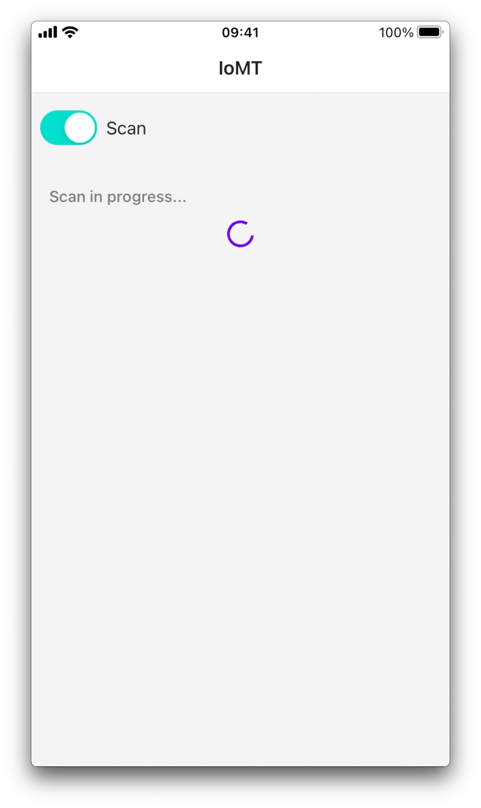
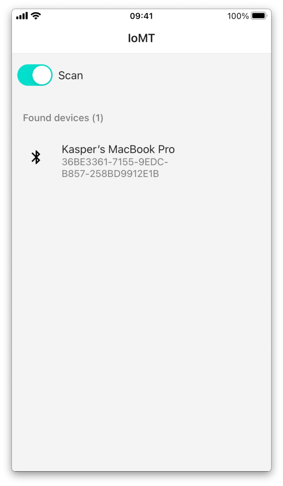
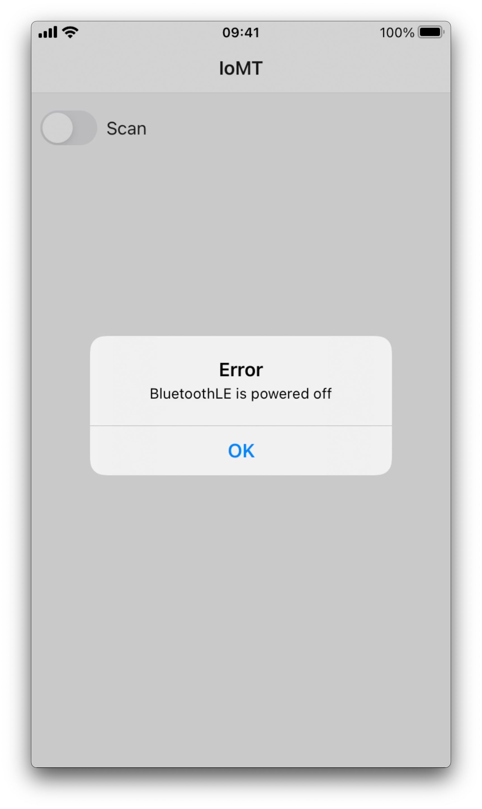
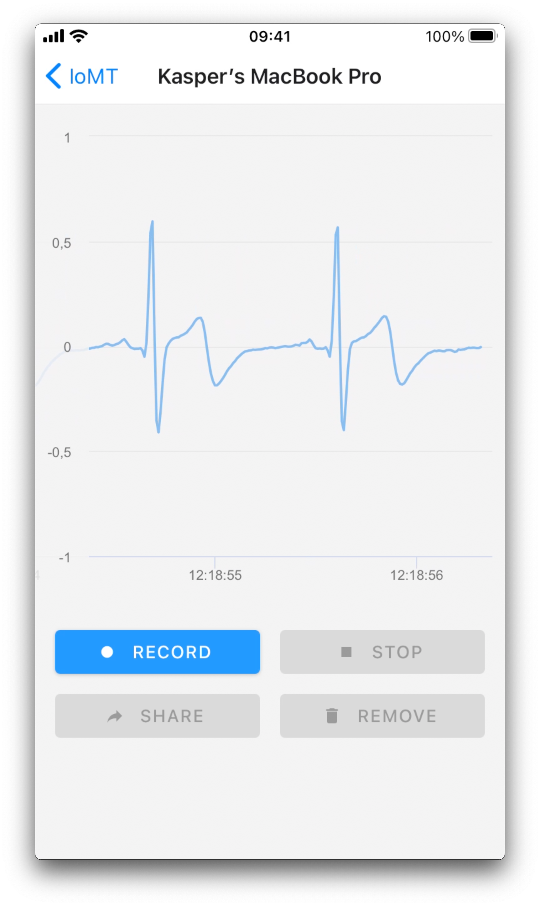
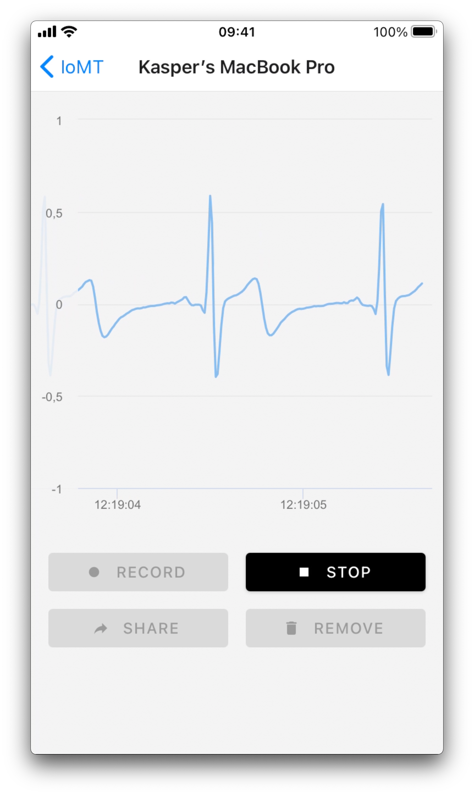
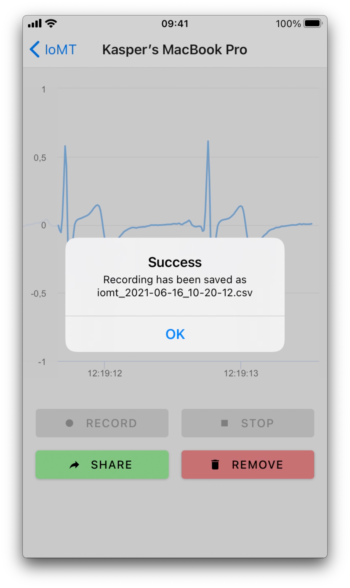
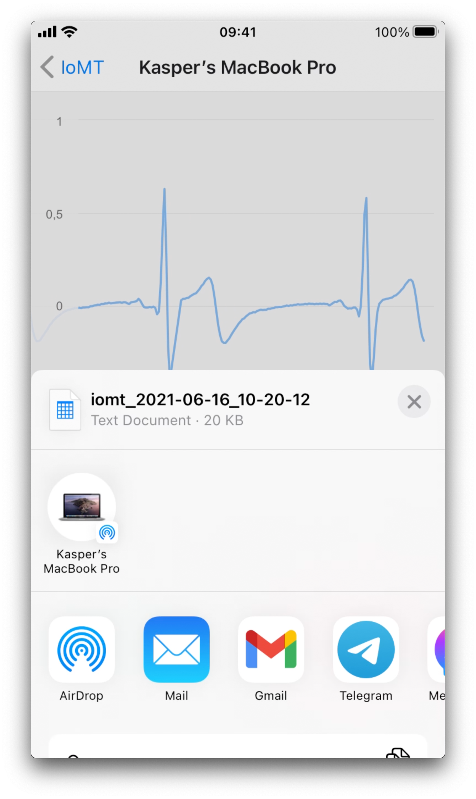
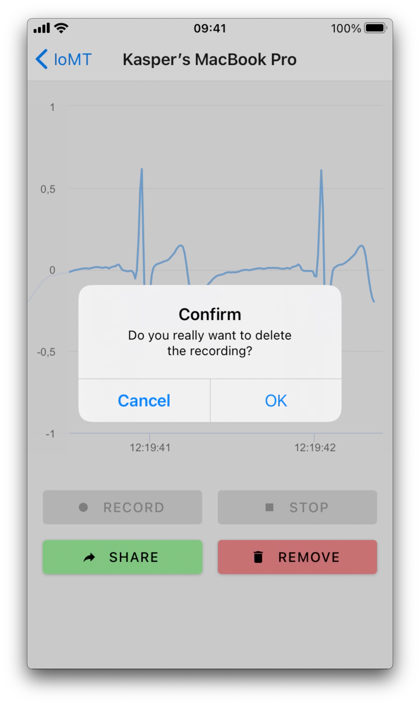
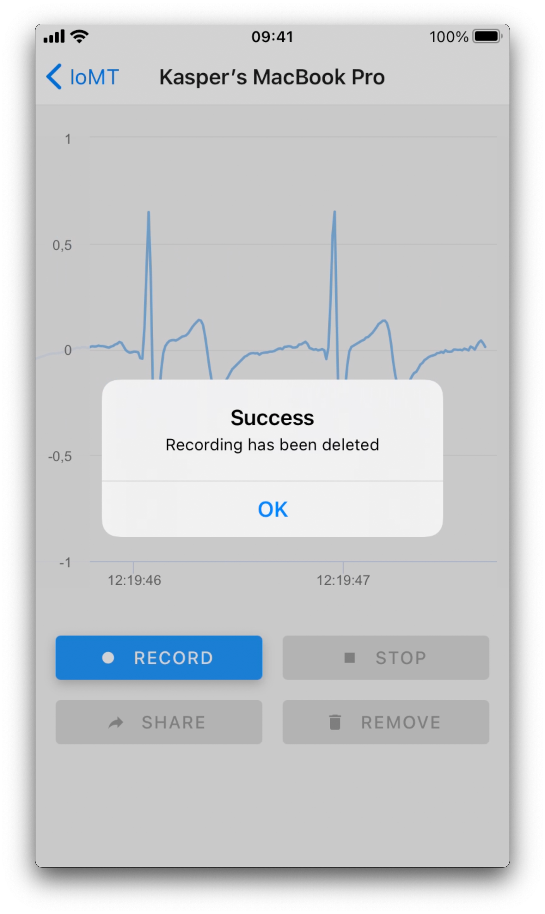

# IoMT app

**This project has been realised as the final assignment for "Medical Informatics" course on AGH University of Science and Technology.**

The mobile app has been implemented in React Native and currently it covers the following functionalities:

- scanning for IoMT devices using Bluetooth Low Energy (BLE),
- establishing a connection with selected device,
- gathering medical signals from IoMT devices in realtime,
- recording the signal and saving data in device's filesystem,
- sending recordings using operating system sharing functionality.

For demonstration purposes, an IoMT device mock has been implemented as well in Node.js. Once the Bluetooth LE connection is established, it transmits a pre-recorded ECG signal in batches.

## Authors

- Kasper Sapała [@kaszperro](https://github.com/kaszperro)
- Tomasz Zawadzki [@tomekzaw](https://github.com/tomekzaw)

## Requirements

- yarn 1.22.10
- Node.js 16.1.0
- Android: NDK 21.3.6528147
- iOS: XCode 12.5, CocoaPods 1.10.1

## Dependencies

### React Native app

- [react-native](https://github.com/facebook/react-native)
- [react-native-ble-plx](https://github.com/Polidea/react-native-ble-plx)
- [react-native-paper](https://github.com/callstack/react-native-paper)
- [react-native-fs](https://github.com/itinance/react-native-fs)
- [react-native-share](https://github.com/react-native-share/react-native-share)
- [react-native-highcharts-wrapper](https://github.com/socrypto/react-native-highcharts-wrapper) (see [pull request](https://github.com/socrypto/react-native-highcharts-wrapper/pull/7)).
- [react-navigation](https://github.com/react-navigation/react-navigation)

### IoMT BLE mock

- [bleno](https://github.com/abandonware/bleno)

<div style="page-break-after: always;"></div>

## Installation

### React Native app

```sh
cd app
yarn install
```

For iOS, it is also required to install pods:

```sh
cd ios
pod install
```

### IoMT BLE mock

```sh
cd node-ble-server
npm i
```

## Running

### React Native app

```sh
cd app
yarn react-native start
yarn react-native run-android
yarn react-native run-ios
```

### IoMT BLE mock

```sh
cd node-ble-server
node main.js
```
<div style="page-break-after: always;"></div>

## Implementation

We decided to implement the mobile application in React Native as we had prior experience with this framework.
As the first step, we researched available solutions for handling Bluetooth connectivity. We finally opted for [react-native-ble-plx](https://github.com/Polidea/react-native-ble-plx) due to being well-documented and actively maintained.

In the meantime, we started implementing an IoMT device mock for ESP32 board in Arduino. We quickly abandoned this approach in favour of developing the mock for desktop in Node.js using [bleno](https://github.com/noble/bleno) library which perfectly matched our requirements. Due to installation problems on MacOS, we finally switched for [@abandonware/bleno](https://github.com/abandonware/bleno) which is a fork of previously mentioned library.

For the first iteration, we implemented a simple demo app, which would scan for BLE devices, then establish a connection and finally read the value from the appropriate characteristic. Because react-native-ble-plx library operates on base64-encoded payloads, we used [buffer](https://github.com/feross/buffer) library, which adds polyfills analogous to Buffer API from Node.js.

As our app needed to show the signal in realtime, we utilized the notification capabilities of characteristics in order to periodically transmit a new value as well as characteristic monitoring to process the incoming data on the client side.

We also added multi-screen support using [react-navigation](https://github.com/react-navigation/react-navigation) [stack navigator](https://github.com/react-navigation/react-navigation/tree/main/packages/stack). Then we designed and implemented another screen containing a switch for toggling scan as well as showing a list of all detected devices, allowing the user to select the appropriate one basing on its name and identifier. For UI components like buttons or list with icons we used [react-native-paper](https://github.com/callstack/react-native-paper) with Material Community Icons from [react-native-vector-icons](https://github.com/oblador/react-native-vector-icons) which quite unexpectedly took a significant amount of time to setup for iOS.

Having the main part implemented, we focused on realtime plotting. The initial implementation was based on [react-native-chart-kit](https://github.com/indiespirit/react-native-chart-kit) which internally uses [react-native-svg](https://github.com/react-native-svg/react-native-svg) library to rasterize the plot. However, it supports neither animating nor scrolling as well as refreshing the plot more often would cause the app to be unresponsive due to JS thread being overloaded. Despite the long research, we still had found no other React Native library for plots that would suit all of our requirements. Finally we used [react-native-highcharts-wrapper](react-native-highcharts-wrapper) which turned out to be a simple WebView wrapper for [Highcharts](https://github.com/highcharts/highcharts), a charting library for web.

It took us a few moments to realize that the plot could only be accessed from the JS context of WebView, which is totally independent from the JS context of React Native, thus adding new points would not be as simple as we initially thought. We finally came up with a hacky solution to expose a function for adding points in the WebView JS context which would be invoked with appopriate arguments on each notify via a WebView method. For this purpose, we needed to patch the react-native-highcharts-wrapper library to add support for forwarding a React reference to WebView component (see [pull request](https://github.com/socrypto/react-native-highcharts-wrapper/pull/7)).

As the last step, we added support for signal recording and appropriate UI controls. The application was originally indended to send recordings to the cloud, but we proposed an alternative approach. When the recording is stopped, the data is saved as an CSV file in the device's filesystem using [react-native-fs](https://github.com/itinance/react-native-fs) library. Using native sharing functionality of operating system, the file can be sent as an attachment via e-mail or uploaded to a cloud drive using a third-party application of user's choice. Having issues with sharing files on Android using original React Native Share API, we switched to [react-native-share](https://github.com/react-native-share/react-native-share) which works perfectly on both platforms.


## Further improvements

- Increase MTU for notifications
- Use binary protocol instead of JSON

<div style="page-break-after: always;"></div>

## Demo

Click below to see the recorded video of our application:

[YouTube link](http://www.youtube.com/watch?v=c5qWgkflI20)

<a href="http://www.youtube.com/watch?v=c5qWgkflI20">
    
</a>

Once the switch is toggled, the app will start scanning for IoMT devices nearby.



<div style="page-break-after: always;"></div>

When any device is detected, its name and identifier will be visible.



If Bluetooth adapter is turned off, the following alert will show up.

**Note:** On Android it is also necessary to enable location services.



<div style="page-break-after: always;"></div>

When a device is selected, the connection will be established and the app will read the signal from the device.



You may start recording anytime.



<div style="page-break-after: always;"></div>

Once you stop the recording, the data will be saved to a file `iomt_{date}_{time}.csv` on your device.



Then it is possible to share the file using native sharing functionality of your device's operating system.



<div style="page-break-after: always;"></div>

When deleting the recording, the app will ask you to confirm.



Once the file is deleted, the success message will show up.


